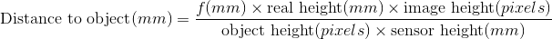

# Screen-to-face-distance

## [Blog post](https://ivanludvig.github.io/blog/2019/07/20/calculating-screen-to-face-distance-android.html)
## [Paper](https://www.techrxiv.org/articles/preprint/Calculating_screen_to_face_distance/12951320)

Android app that calculates the distance between a user's face and his phone

It's based on the distance between eyes. The further the face, the less the distance between your eyes appears on the camera.  

The formula I used is:  

